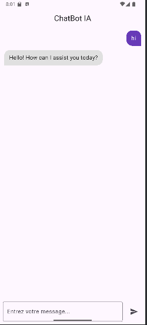
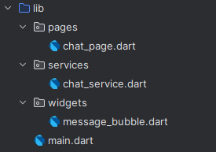

# Flutter ChatBot App

Une application mobile Flutter simple qui utilise l'API **OpenRouter.ai** pour interagir avec un **LLM (modèle GPT-3.5-turbo)** en temps réel.  
Fonctionne gratuitement sans carte bancaire, grâce à OpenRouter.

---

##  Fonctionnalités

- Interface de chat utilisateur/bot
- Intégration avec OpenRouter (GPT-3.5 ou autre modèle)
- Bulles de message stylisées
- Animation de chargement
- API rapide, facile à configurer

---

##  Aperçu

---

##  Structure du projet

